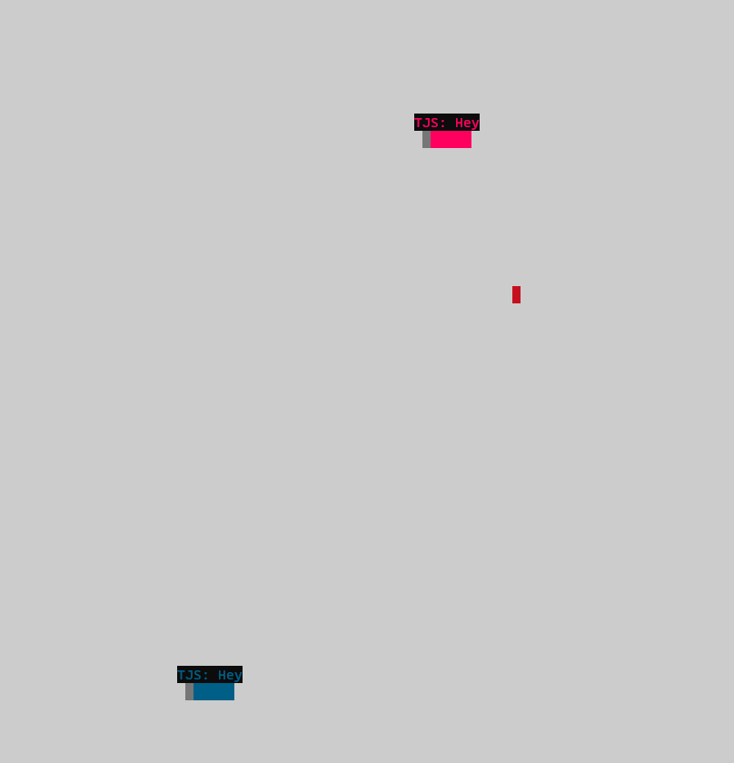

# Snake Client Project

Snake is a classic video game where the player maneuvers a dot, growing it by consuming pieces of food. As the snake grows, it becomes a challenging obstacle to navigate. The objective is to achieve maximum growth without colliding with walls or the snake's own body.

This project is a multiplayer adaptation of the traditional Snake game genre.

Before running this client, ensure you have the server-side up and running. You can download and install it from the [snek-multiplayer GitHub repository](https://github.com/lighthouse-labs/snek-multiplayer).

## Final Product



## Getting Started

1. Follow the instructions in the snek server repository to set up and run the server-side. Then in terminal.

   ```
   npm run play
   ```

2. Run the development snake client using the following command:
   
   ```
   node play.js
   ```

Now you're ready to enjoy multiplayer Snake with your friends!

## Controls

- Use the following keys to control the snake:

  - **Arrow Keys**: Move the snake up, down, left, or right.
  - **W**: Move the snake up.
  - **A**: Move the snake left.
  - **S**: Move the snake down.
  - **D**: Move the snake right.
  - **E**: Send a message to the server (e.g., "Say: "Sssnake"").
  - **Q**: Send a message to the server (e.g., "Say: "TOO SLOW!"").
  - **B**: Send a message to the server (e.g., "Say: "BOO YAAA!"").

- Press `Ctrl + C` to exit the game.
